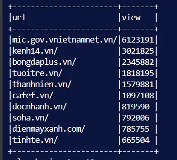
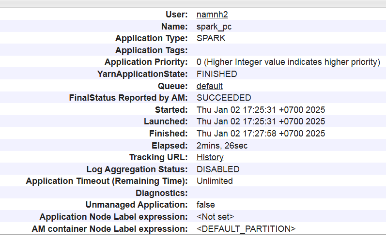

# hd sp

Created: December 27, 2024 10:32 AM
Class: My Reports

| Tham số trong spark-submit | Giá trị | Ý nghĩa |
| --- | --- | --- |
| —master  | yarn | submit trên yarn |
| —num-executors  | 3 | số executor |
| —executor-cores | 4 | số thread của executor |
| —executor-memory | 2500M | bộ nhớ executor |
| —driver-memory | 1G | bộ nhớ driver, quản lý các task |

# 1. Đưa ra top 10url có lượt view cao nhất pc&mb

Nhóm theo domain+path, đếm số bản ghi

PC

MB

# 2. Đưa ra top 10 url có lượng user đọc cao nhất

nhóm theo domain và path, đếm số user

Viết 1 session đọc cả 2 directory

PC

MB

# 3. Phân bố user có click

Lọc ra các guid có click

nhóm theo campaignId, guid, sau đó sắp xếp mỗi nhóm theo time_create

Tạo 1 cột mới để đánh số thứ tự cho các bản ghi 

Chọn ra bản ghi có click_or_view là true, lấy stt trừ 1 ra được số view trước khi phát sinh click

ví dụ

| campaignId | guid | click_or_view | stt |
| --- | --- | --- | --- |
| 1 | 2 | false | 1 |
| 1 | 2 | false | 2 |
| 1 | 2 | true | 3 |
| 1 | 2 | false | 4 |

⇒ user 2 có 3-1 = 2 view trước khi click

### vấn đề? liệu 1 user có click 2 lần

Thống kê số user theo n view:

Phân bố dữ liệu:

Histogram:

Thời gian: 

