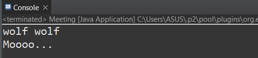

# Tuần 1: Object-Oriented-Programming in Java

Created: October 4, 2024 12:13 AM
Class: My Reports

# 1. Object-Oriented-Programming

## Bốn tính chất của lập trình hướng đối tượng:

- Tính đóng gói (Encapsulation)

Tính đóng gói là đưa tất cả các biến thực thể và phương thức vào trong một Class. Đóng gói còn có nghĩa là che giấu dữ liệu và phương thức, bảo vệ khỏi những thay đổi không đáng có. Ví dụ cụ thể là phương thức getName() của Class Vet sẽ giúp lấy thuộc tính name của một Object Vet, còn truy cập trực tiếp sẽ báo lỗi

```java
package main;

public class Vet {
	//hide the name attribute
	private String name;
	
	public Vet(String a) {
		this.name = a;
	}
	
	public String getName() {
		return this.name;
	}
	
	public void inject(Animal a) {
		a.makeNoise();
	}
}

```

```java
package main;

public class Meeting {
	public static void main(String argc[]) {
		
		Vet vet1 = new Vet("Nam");
		System.out.println(vet1.getName());
		System.out.println(vet1.name); // error
		//vet1.inject(dog1);
	}
}
```

- Tính trừu tượng (Abstraction)

Là khả năng của chương trình tập trung vào những gì cốt lõi cần thiết. Tính trừu tượng còn được thể hiện qua việc một đối tượng ban đầu có thể có một số đặc điểm chung cho nhiều đối tượng khác nhưng bản thân đối tượng này cũng có thể không có các phương thức cụ thể. Tính trừu tượng được xác định qua lớp trừu tượng. Dưới đây là lớp trừu tượng Animal với từ khóa **abstract,** lớp này sẽ đặc điểm chung của các loài động vật, chẳng hạn như name. Mục đích quan trọng của abstract class là để có đa hình cho đối số, kiểu trả về, …  (ghi đè phương thức)

```java
package main;

public abstract class Animal {
	
	private String name;
	
	public Animal(String a) {
		this.name = a;
	}
	public String getName() {
		return this.name;
	}
	
	public abstract void makeNoise();
}

```

- Tính kế thừa (Inheritance)

Là khả năng tạo một class mới dùng chung các thuộc tính và phương thức của class đã có với những đặc điểm cụ thể hơn. Class Cat và Dog là con của class Animal, thừa kế thuộc tính name và phương thức makeNoise() của class Animal

- Tính đa hình (Polymorphism)

Đa hình là khả năng tồn tại ở nhiều hình thức. Đa hình đi kèm với các quan hệ thừa kế, các đối tượng thuộc các lớp cụ thể khác nhau có thể được gửi cùng một thông điệp, khi nhận được thông điệp đó, các đối tượng này có thể hiểu theo các cách khác nhau. Class Dog và Cow được kế thừa từ Class Animal

```java
package main;

public abstract class Animal {
	
	private String name;
	
	public Animal(String a) {
		this.name = a;
	}
	public String getName() {
		return this.name;
	}
	
	public abstract void makeNoise();
}

```

```java
package main;

public class Dog extends Animal implements Pet {
	
	public Dog(String a) {
		super(a);
	}
	
	@Override public void makeNoise() {
		System.out.println("wolf wolf");
	}
	@Override public void beFriendly() {
		System.out.println(this.getName() + " is friendly");
	}
	
	@Override public void play() {
		System.out.println(this.getName() + " is playing..");
	}
}

```

```java
package main;

public class Cow extends Animal {
	private static int count = 0;
	
	public Cow(String a) {
		super(a);
		count++;
	}
	
	@Override public void makeNoise() {
		System.out.println("Moooo...");
	}
	
	public static int getNumCows(){
		return count;
	}
	
}

```

Dùng tham chiếu kiểu lớp cha Animal để chiếu tới các đối tượng của lớp con Dog và Cow, đối xử với các loại con của Animal như chúng là chính đối tượng của Animal, makeNoise() được thực hiện theo cách khác nhau tùy theo đối tượng



### Từ khóa *interface*

Interface cho phép giải quyết vấn đề đa thừa kế trong java, tránh được vấn đề nhập nhằng về ngữ nghĩa. Một interface là một class thuần túy trừu tượng bao gồm toàn các phương thức public abstract và không có biến thực thể. Trong chương trình này, interface Pet được tạo ra để giải quyết vấn đề Dog, Cat và Cow đều là con của Animal nhưng chỉ có Dog và Cat là có các phương thức của Pet

```java
package main;

public interface Pet {
	public abstract void beFriendly();
	public abstract void play();
}

```

### Từ khóa *static*

Đôi khi ta muốn tạo một biến để dùng chung cho tất cả các object của một Class. Biến này là biến static. Theo tính đóng gói, ta muốn che giấu đi thuộc tính bên trong nhưng ta vẫn muốn cho phép đọc giá trị của biến từ bên ngoài; đồng thời, có thể gọi phương thức này thông qua chính Class, không cần thông qua object vì object nào gọi phương thức cũng như nhau

```java
package main;

public class Cow extends Animal {
//static variable to count the number of cows
	private static int count = 0;
	
	public Cow(String a) {
		super(a);
		count++;
	}
	
	@Override public void makeNoise() {
		System.out.println("Moooo...");
	}
	
	public static int getNumCows(){
		return count;
	}
	
}

```

## Năm tính chất trong Solid

### Single responsibility principle (SRP) - Nguyên lý đơn chức năng

Mỗi class chỉ nên giữ một trách nhiệm duy nhất. Thay vì để Class Animal chứa toàn bộ phương thức của Dog và Tiger, Class Dog chỉ chứa các thuộc tính và phương thức riêng của Dog.

### Open-Closed principle(OCP) - Nguyên lý đóng mở

Có thể thoải mái mở rộng 1 Class nhưng không được sửa đổi bên trong Class đó. Ở đây, class mới là Bird được tạo mới, chỉ cần kế thừa Class Animal, không cần cài đặt lại hay chỉnh sửa bên trong Class Animal

```java
package main;

public class Bird extends Animal {
	public Bird(String a){
		super(a);
	}
	
	public void makeNoise() {
		System.out.println(this.getName() + " says Tweet");
	}
}

```

Chỉ cần ghi đè phương thức makeNoise

### Liskov substitution principle (LSP) - Nguyên lý thay thế

Trong một chương trình, các object của Class con có thể thay thế class cha mà không làm thay đổi tính đúng đắn của chương trình. Một đối tượng trong class con Dog hoàn toàn có thể thay thế được một đối tượng của class cha là Animal, mang đầy đủ các thuộc tính và phương thức của class Animal, không làm thay đổi hành vi của Animal

### Interface segregation principle (ISP) - Nguyên lý phân tách

Thay vì dùng một interface lớn, ta nên tách thành nhiều interface nhỏ, với nhiều mục đích cụ thể. Class Dog và Tiger đều được kế thừa từ class cha Animal. Nhưng Dog là thú nuôi trong nhà nên có thể có các phương thức về Pet, còn Tiger là động vật hoang dã nên có thể Hunt. Thay vì cài đặt chung một interface chung cho cả 2 loài, có thể gây dư thừa, khó quản lý thì ta tách riêng ra thành 2 interface là Pet và Hunt

```java
package main;

public interface Hunt {
	public abstract void hunt();
}

```

```java
package main;

public interface Pet {
	public abstract void beFriendly();
	public abstract void play();
}

```

### Dependency Inversion Principle (DIP) - Nguyên lý đảo ngược phụ thuộc

Các modul cấp cao không nên phụ thuộc vào các modul cấp thấp. Cả hai nên phụ thuộc vào abstraction. Ở đây, việc trừu tượng hóa phương thức makeNoise giúp cho các modul cấp thấp như Dog, Cat không phụ thuộc vào Class Animal. Nếu muốn thêm loài mới chỉ việc tạo thêm Class.

```java
package main;

public interface MakeNoise {
	public void makeNoise();
}

```

## Biểu đồ UML


# 2. Đọc ghi file

## Đọc ghi file text

Đọc ghi file text sử dụng FileReader và FileWriter, cùng với Buffered để hỗ trợ đọc ghi nhanh hơn

Mỗi lần yêu cầu FileWriter ghi một chuỗi dữ liệu nào đó, chuỗi đó lập tức được đổ vào file. Chi phí xử lý cho mỗi lần ghi file là rất lớn so với chi phí thao tác trong bộ nhớ. Khi nối một dòng BufferWriter với một FileWriter, BufferWriter sẽ giữ những gì được ghi đến khi đầy. Chỉ khi bộ nhớ đệm BufferWriter đầy thì FileWriter mới được lệnh ghi dữ liệu ra đĩa

```java
package characterstream;
import java.io.FileReader;
import java.io.FileWriter;
import java.io.BufferedReader;
import java.io.BufferedWriter;
import java.io.IOException;
public class Main {

	public static void main(String[] args) throws IOException{
		// TODO Auto-generated method stub
		//FileReader in = null;
		//FileWriter out = null;
		
		try {
			FileReader fr = new FileReader("input.txt");
			FileWriter fo = new FileWriter("output.txt");
			
			BufferedReader in = new BufferedReader(fr);
			BufferedWriter out = new BufferedWriter(fo);
			int c;
			while((c = in.read()) != -1) {
				out.write(c);
				System.out.println(c);
			}
			System.out.println("Success!");
			in.close();
			out.close();
		}
		finally {}
		
	}

}

```

## Đọc ghi file binary

Đọc ghi file binary sử dụng FileInputStream và File OutputStream:  dòng kết nối với các file binary để đọc/ghi theo dạng tuần tự

```java
package javaBinary;
import java.io.FileInputStream;
import java.io.FileOutputStream;
//import java.io.DataInputStream;
//import java.io.DataOutputStream;
import java.io.IOException;
import java.io.FileNotFoundException;
//import java.nio.charset.StandardCharsets;
public class JavaBinary {
		
	private static final String file_name = "Lato-Regular.bin";
	private static final String output = "outputNew.txt";
		
	public static void main(String[] args) throws IOException {
		// TODO Auto-generated method stub
		
		byte[] buffer = new byte[1024];
		FileInputStream fis = new FileInputStream(file_name);
		FileOutputStream fos = new FileOutputStream(output);
		
		//FileOutputStream out = null;
		
		try {	
			int c = -1;
			while((c = fis.read(buffer)) != -1) {
				fos.write(buffer, 0, c);
				for(byte x : buffer) {
					System.out.println(x);
				}
				
			}
			System.out.println("Success");
		}
		catch (FileNotFoundException e) {
			System.out.println(e.getMessage());
		}
		finally {
			fis.close();
			fos.close();
		}
		
		
	}

}

```

## List các file và thao tác

```java
package fileInteracting;
import java.util.Scanner;
import java.io.*;
public class FileInteracting {
	public static String[] files;
	public static void main(String[] args) throws IOException{
		// TODO Auto-generated method stub
		//create a new folder
		File folder = new File("New Folder");
		//folder.mkdir();
		String path = folder.getAbsolutePath();
		System.out.println(path);
		//list all files of an folder
		
		System.out.println("All the files in this folder: ");
		int count = 0;
		if (folder.isDirectory()) {
			files = folder.list();
			
			for (String file : files) {
				System.out.println("   (" + ++count + ") " + file );
				
			}
		}
		while(true) {
			System.out.println("Choose the file to read, press 0 to end ");
			
			Scanner input = new Scanner(System.in);
			int option = input.nextInt();
			
			if(option > count || option < 0) {
				System.out.println("invalid, please choose again");
			}
			else if (option == 0) {
				System.out.println("Terminated");
				input.close();
				break;
			}
			else {
				FileReader in = new FileReader(path + "/" + files[option-1]);
				
				try {
					int c = -1;
					while ((c = in.read()) != -1) {
						System.out.print((char)c);
					}
					System.err.println();
					in.close();
				}
				catch(IOException e) {
					e.printStackTrace();
				}
				finally {
				}
			}
			
		}

	}
}

```