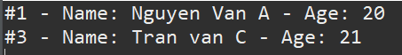

# Tuần 2: Collectionn, Design Pattern và Serialize

Created: October 9, 2024 10:26 AM
Class: My Reports

# 1. Collections

## ArrayList

Class ArrayList trong Java là một Array có thể thay đổi kích thước. ArrayList có thể thêm, xóa và thay đổi phần tử bên trong, trong khi các phần tử Array thì không thể bị thay đổi, phải tạo Array mới nếu muốn thay đổi. ArrayList có lưu các phần tử theo thứ tự được thêm vào

Một số các phương thức cơ bản của ArrayList:

- add(item): Thêm một phần tử vào cuối ArrayList
- add(index, item): Thêm một item vào vị trí index
- get(index): Lấy phần tử từ vị trí index
- size(): Trả về kích thước của ArrayList
- set(index, new_value): Thay đổi giá trị
- remove(index): Xóa item ở vị trí index
- clear(): Xóa tất cả phần tử
- contains(item): Kiếm tra tồn tại

## HashMap

HashMap lưu trữ dữ liệu bên trong ở dạng key-value. Thực chất, mỗi cặp được lưu trong 1 đối tượng của class Entry<K, V>. Trong class này có 4 trường key, value, next (phần tử kế tiếp), hash (mã băm của khóa). Khi đưa vào 1 phần tử, nó sử dụng hashcode của khóa để quyết định index cho cặp key-value cụ thể. HashMap lưu các phần tử không theo thứ tự chèn

Một số các phương thức sử dụng:

- put(k,v): Thêm một item mới vào Hashmap
- get(k): Truy cập giá trị thông qua khóa
- remove(k): loại bỏ phần tử có khóa k
- replace(k,new v): sửa giá trị của một entry
- size(): trả về kích thước hashmap
- clear(): xóa toàn bộ phần tử trong HashMap
- keySet():  trả về danh sách các khóa của Hashmap
- containsKey(key): kiểm tra tồn tại khóa key

## HashSet

HashSet chỉ chứa các phần tử duy nhất, không trùng lặp. HashSet lưu trữ dữ liệu dưới dạng Object. Khi một đối tượng HashSet được khởi tạo, một đối tượng HashMap cũng được tạo ra để lưu giữ các phần tử của HashSet như các khóa key, còn giá trị value kết hợp với các khóa key đó sẽ là một hằng số. Do đó, hashSet cũng không lưu theo thứ tự chèn

Một số các phương thức sử dụng:

- add(item): thêm một item vào HashSet
- contains(item):  kiểm tra item có trong HashSet
- remove(item): xóa item khỏi HashSet
- clear(): xóa toàn bộ item
- size(): trả về kích thước của HashSet

## Phương thức equals()

Lớp cha Object định nghĩa hai phương thức equals và hashCode

Phương thức equals dùng để so sánh hai đối tượng về mặt ngữ nghĩa. Khác với toán tử == só sánh hai đối tượng bằng cách so sánh hai tham chiếu (địa chỉ)

## Phương thức hashCode()

Phương thức hashCode dùng để tạo ra giá trị mã băm, giá trị này được dùng trong các Collection như HashMap, HashSet để nhóm các đối tượng có cùng mã băm.

Các bước để định vị một đối tượng trong bảng băm:

- Tính giá trị mã băm của phần tử được chỉ định bằng hashCode()
- Tìm nhóm chứa mã băm
- Bên trong nhóm, tìm phần tử chính xác bằng phương thức equals

Lớp Student có các thuộc tính id, name, age. Phương thức equals được ghi đè để so sánh id của hai object. Nếu id khác nhau thì hai object đó khác nhau

```java
@Override
	public boolean equals(Object s) {
		if (s instanceof Student) {
			Student newStudent = (Student) s;
			if(this.id == newStudent.id) {
				return true;
			}
		}
		return false;
	}
```

Trong class CheckEqualStudent tạo 3 object của Class Student student1, student2, student3, trong đó student1 với student2 có cùng id là 1 và một HashSet hset

```java
		Student student1 = new Student(1, "Nguyen Van A", 20);
		Student student2 = new Student(1, "Nguyen van B", 21);
		Student student3 = new Student(3, "Tran van C", 21);
		
		Set<Student> hset = new HashSet<Student>();
		hset.add(student1);
		hset.add(student2);
		hset.add(student3);
		
		for (Student s:hset) {
			System.out.println(s);
```

Khi duyệt, mặc dù student1 và student2 có cùng id nhưng vẫn được in ra, lý do là bởi khi không ghi đè hashCode, chương trình tự động lấy tham chiếu của đối tượng để sinh ra mã băm, do đó mỗi đối tượng khác nhau sẽ có mã băm khác nhau nên student1 và student2 là khác nhau

Để khắc phục, ta ghi đè phương thức hashCode()

```java
@Override
	public int hashCode() {
		return 101 + id;
	}
```

Kết quả trả ra student2 không được thêm vào hashSet do có trùng id. Đúng theo tính chất của HashSet



# 2. Design Pattern

## 2.1 Factory Method Pattern (Creational Design Pattern)

Nhiệm vụ của Factory Pattern là để quản lý và trả về các đối tượng theo yêu cầu, linh hoạt hơn trong cách khởi tạo đối tượng

Factory Method Pattern bao gồm:

- Super class: interface hoặc abstract class
- Sub Class: các subclass sẽ implement các phương thức của super class
- Factory Class: class chịu trách nhiệm khởi tạo các đối tượng Sub Class dựa theo tham số đầu vào

Ví dụ hệ thống thanh toán hiện đang sử dụng hai dịch vụ ngân hàng VCB và BIDV, họ muốn sau này mở rộng thêm nhiều ngân hàng khác mà không cần sửa code bên phía Client

## 2.2 Observer Pattern (Behavior Pattern)

Định nghĩa một kiểu quan hệ phụ thuộc 1 nhiều giữa các đối tượng để khi một đối tượng thay đổi trạng thái, các đối tượng phụ thuộc sẽ tự động thay đổi

Các thành phần trong Observer Pattern:

- Observer: định nghĩa một phương thức update() cho các đối tượng sẽ được subject thông báo đến khi có sự thay đổi trạng thái
- Subject: Chứa danh sách các observer, cung cấp phương thức để có thể thêm và loại bỏ observer

## 2.3 Adapter Pattern (Structural Pattern)

Adapter Pattern cho phép các inteface (giao diện) không liên quan tới nhau có thể làm việc cùng nhau. Đối tượng giúp kết nối các interface gọi là Adapter.

- **Adaptee**: định nghĩa interface không tương thích, cần được tích hợp vào.
- **Adapter**: lớp tích hợp, giúp interface không tương thích tích hợp được với interface đang làm việc. Thực hiện việc chuyển đổi interface cho Adaptee và kết nối Adaptee với Client.
- **Target**: một interface chứa các chức năng được sử dụng bởi Client (domain specific).
- **Client**: lớp sử dụng các đối tượng có interface Target.

# 3. Serialize

Serialize là cơ chế chuyển đổi trạng thái của đối tượng thành một luồng byte, sử dụng để duy trì và khôi phục trạng thái của đối tượng

Khi một Object được chuỗi hóa, tất cả các đối tượng mà biến thực thể này tham chiếu tới cũng bị chuỗi hóa, tất cả các đối tượng mà các đối tượng này tham chiếu tới cũng bị chuỗi hóa. Công việc này được thực hiện đệ quy tự động

Để bỏ qua một biến khi chuỗi hóa, ta dùng từ khóa ***transient***

Trong chương trình, Class GameCharacter có 3 thuộc tính là name, health, weapon. Để serialize được ta cần implement Serializable interface

```java
public class GameCharacter implements Serializable {
	private String name;
	private int health;
	private String weapon;
	...
	}
```

Trong Class Serializable, ta khởi tạo một Object zombie, có 100 health và weapon là teeth. Sau đó tạo dòng ra file và dòng ra đối tượng rồi tiến hành đọc các đối tượng

Đối tượng đã được chuỗi hóa thành công


Để khôi phục đối tượng, làm tương tự bằng cách tạo dòng vào file và dòng vào đối tượng


Sau khi thêm từ khóa ***transient*** vào thuộc tính teeth và Serialize, thuộc tính đó sẽ được bỏ qua và khi khôi phục, thuộc tính đó sẽ là 0

