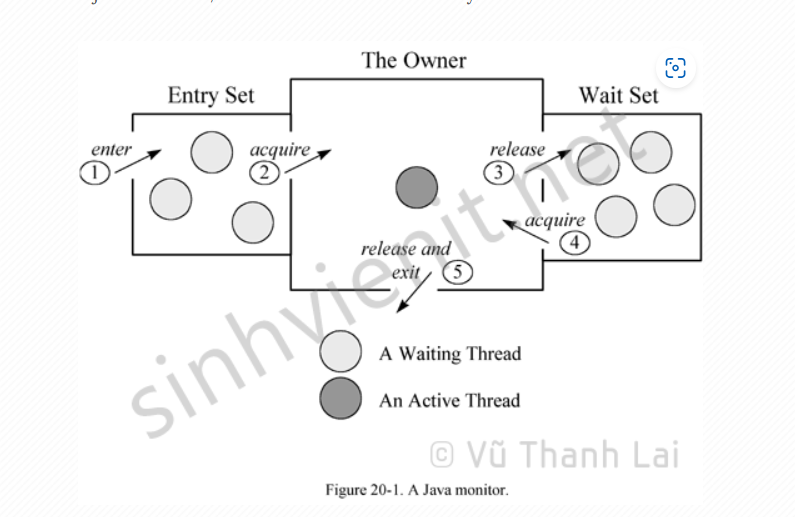

# Tuần 3: Exception, Concurrency và Json

Created: October 23, 2024 11:09 AM
Class: My Reports

# 1. Exception

Là một sự kiện xảy ra làm phá vỡ flow bình thường của chương trình, có thể làm chết chương trình

Exception kế thừa từ lớp cha Throwable. Trong Exception có Runtime Exception và các Exception khác

## Unchecked Exception

Runtime Exception là exception chỉ có thể phát hiện trong runtime.  Các exception kế thừa Runtime Exception là Unchecked Exception, được bỏ qua trong quá trình complie nên không bắt buộc phải xử lý nó.Do đó để complier báo lỗi được thì phải xử lý

```java
public static double divide(int a, int b) {
		return a/b;
	}
```

Trong chương trình, khi số chia bằng 0, complier sẽ không báo lỗi tại thời điểm biên dịch.

Một số loại unchecked exception tiêu biểu

- ArithmeticException: phép toán không hợp lệ
- NullPointerException: truy cập hoặc sử dụng một đối tượng null
- ArrayIndexOutOfBoundsException: truy cập vào một chỉ số mảng không tồn tại

## Checked Exception

Là những Exception mà complier kiểm tra tại thời điểm biên dịch. nếu một phương thức có khả năng phát sinh một CE, bắt buộc ta phải xử lý, Java sẽ không biên dịch thành công nếu các CE không được xử lý.

- **IOException**:

Xuất hiện khi có lỗi nhập/xuất dữ liệu, ví dụ khi đọc/ghi file.

Các lớp con: FileNotFoundException, EOFException,

UnsupportedEncodingException v.v.

- **ClassNotFoundException**:

Xuất hiện trong quá trình complier, khi JVM không thể tìm thấy class được yêu cầu.

- **SQLException:**

Xuất hiện khi có lỗi trong quá trình truy vấn cơ sở dữ liệu

- **InterruptedException:**

Phát sinh khi một thread đang chờ, ngủ, hoặc bận rộn, và một thread khác đã làm gián đoạn nó.

# 2. Concurrency

## Runnable

Runnable interface trong Java biểu diễn một task có thể thực hiện đồng thời bởi luồng

## Threadpool

ThreadPool được dùng để giới hạn số lượng Thread được chạy bên trong ứng dụng của chúng ta trong cùng một thời điểm. Nếu chúng ta không có sự giới hạn này, mỗi khi có một Thread mới được tạo ra và được cấp phát bộ nhớ bằng từ khóa new thì sẽ có vấn đề về bộ nhớ và hiệu suất, có thể dẫn đến lỗi crash chương trình.

Thay vì tạo các luồng mới khi các task mới đến, ThreadPool sẽ giữ một số luồng nhàn rỗi (no task) đã sẵn sàng để thực hiện tác vụ nếu cần. Sau khi một thread hoàn thành việc thực thi một tác vụ, nó sẽ không chết mà vẫn hoạt động trong ThreadPool và chờ nhiệm vụ mới.

Một vài loại threadpool

- **Cached thread pool**: giữ một số luồng còn sống (alive) và tạo ra các luồng mới nếu cần.
- **Fixed thread pool**: giới hạn số lượng tối đa của các Thread được tạo ra để thực thi các task (nhiệm vụ). Các task khác đang chờ trong hàng đợi (BlockingQueue).
- **Single-threaded pool**: chỉ giữ một Thread thực thi một nhiệm vụ một lúc.
- **Fork/Join pool**: một Thread đặc biệt sử dụng Fork/ Join Framework để tận dụng lợi thế của nhiều bộ vi xử lý để thực hiện công việc lớn nhanh hơn bằng cách chia nhỏ công việc thành các phần nhỏ hơn để xử lý đệ quy.

## Executor

Một Executor là một đối tượng chịu trách nhiệm quản lý các luồng và thực hiện các tác vụ Runnable được yêu cầu xử lý. Nó tách riêng các chi tiết của việc tạo Thread, lập kế hoạch (scheduling), … để chúng ta có thể tập trung phát triển logic của tác vụ mà không quan tâm đến các chi tiết quản lý Thread

### Race condition

**Race condition** (điều kiện tương tranh) xảy ra khi hai hoặc nhiều luồng cùng truy cập và sửa đổi một tài nguyên chung mà không có đồng bộ hóa (synchronization) thích hợp, dẫn đến hành vi không thể dự đoán.

## Synchronize

Nếu các luồng cùng truy xuất đến 1 biến dữ liệu hoặc 1 phương thức nhờ vào lý do đã nói ở phần trên, điều này có thể gây ra việc sai lệch dữ liệu. Đồng bộ hóa (synchronized) chính là việc xắp xếp thứ tự các luồng khi truy xuất vào cùng đối tượng sao cho không có sự xung đột dữ liệu.

**Quá trình đồng bộ hóa các luồng bởi JVM**



- Synchronized method: khóa toàn bộ phương thức của một instance của object (**this**).
- Synchronized block: khóa một phần của code trong một phương thức.
- Synchronized static method: khóa toàn bộ phương thức của một lớp (**class**).

Synchronized có thể gây ra sự suy giảm về hiệu năng do các thời gian chờ của các thread có thể lớn

### Lock

**Khóa (Lock)** trong Java là một cơ chế đồng bộ hóa mạnh mẽ hơn so với từ khóa synchronized. Cung cấp  sự kiểm soát chi tiết hơn trong việc quản lý truy cập vào các vùng dữ liệu chia sẻ giữa nhiều luồng. Phù hợp sử dụng với các điều kiện khóa phức tạp,  hỗ trợ mở, đóng khóa thủ công, kiểm tra trạng thái khóa, khả năng tái nhập và tùy chỉnh thời gian chờ, có thể thiết kế các thuật toán khóa để giảm thiểu nguy cơ deadlock. 

Một số loại lock

- **ReentrantLock:** Loại Lock cơ bản nhất, cho phép một luồng có thể khóa và mở khóa nhiều lần.
- **ReadWriteLock:** Cho phép nhiều luồng đọc đồng thời nhưng chỉ cho phép một luồng ghi tại một thời điểm.
- **StampedLock:** Là một loại Lock nâng cao, cung cấp các chế độ khóa khác nhau để tối ưu hóa hiệu suất.

## AtomicInterger

AtomicInterger được sử dụng trong các ứng dụng đa luồng, nơi nhiều luồng có thể truy cập và thay đổi cùng một biến mà không cần sử dụng các cơ chế đồng bộ hóa. Có hiệu suất cao nhưng chỉ hỗ trợ số nguyên 

## ConcurrentHashMap

Trong quá trình truy cập đồng thời hashmap từ các luồng khác nhau có thể gây ra race condition làm hỏng cấu trúc dữ liệu của hashmap.

Ứng dụng mang tính đồng thời cao, có thể muốn sửa đổi hoặc đọc giá trị khóa trong các luồng(threads) khác nhau thì đó là lúc lý tưởng để sử dụng Concurrent Hashmap

ConcurrentHashMap chia dữ liệu thành nhiều **segment** (trước Java 8), mỗi segment tương ứng với một phần của bảng băm (hash table). Chỉ các luồng thao tác trên cùng một segment mới phải chờ đợi nhau, giúp tăng khả năng song song
Sau java 8 sử dụng CAS

> In [computer science](https://en.wikipedia.org/wiki/Computer_science), **compare-and-swap** (**CAS**) is an [atomic](https://en.wikipedia.org/wiki/Atomic_(computer_science)) [instruction](https://en.wikipedia.org/wiki/Instruction_(computer_science)) used in [multithreading](https://en.wikipedia.org/wiki/Thread_(computer_science)#Multithreading) to achieve [synchronization](https://en.wikipedia.org/wiki/Synchronization_(computer_science)). It compares the contents of a [memory location](https://en.wikipedia.org/wiki/Memory_location) with a given value and, only if they are the same, modifies the contents of that memory location to a new given value.
> 

Một số phương thức: 

- put() – chèn ánh xạ khóa / giá trị được chỉ định vào bản đồ
- keySet() – trả về một tập hợp tất cả các khóa của bản đồ
- values() – trả về một tập hợp tất cả các giá trị của bản đồ

Các phương thức xử lý song song như forEach, search và reduce với tham số tùy chỉnh parallelthreshold. Nếu kích thước lớn hơn  parallelthreshold, phương thức sẽ được thực hiện song song trên nhiều luồng

### Virtual thread

Một vấn đề lớn của Platform Thread là khi một luồng bị chặn bởi các tác vụ như I/O (ví dụ: đọc/ghi dữ liệu vào file, mạng), OS Thread cũng bị chặn theo, làm tiêu tốn tài nguyên.

ví dụ có 1000 OS thread trong pool, khi hệ thống chạy 1000 concurrent task có thực hiện blocking IO call. Mỗi platform thread sẽ giữ 1 OS thread để thực hiện task. Khi gặp blocking call, 1000 OS thread sẽ đợi. Nếu có task 1001 thì sẽ phải đợi vì hết tài nguyên, sau khi hoàn thành , thead mới được release

Virtual thread cũng được gắn trên OS thread nhưng khi thực hiện blocking call, OS thread sẽ được giải phóng để thực hiện các task khác

# 3. Json

**JSON** (JavaScript Object Notation) là định dạng dữ liệu nhẹ để trao đổi thông tin giữa máy chủ và ứng dụng. 
gồm các cặp key value, trong đó key là chuỗi và value có thể là chuỗi, số, boolean, mảng hoặc đối tượng khác.
Gson chuỗi hóa đối tượng dưới dạng json giúp dễ đọc hơn, khác với cách chuỗi hóa chuẩn của java dưới dạng binary.