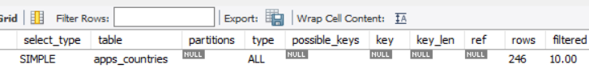

# Tuần 4: Databases

Created: October 25, 2024 11:25 AM
Class: My Reports

# 1. MySQL

MySQL parser - bộ phân tích cú pháp truy vấn bao gồm 2 thành phần: lexical scanner (phân tích từ vựng) và grammar rule module (phân tích ngữ pháp)

Bộ phân tích từ vựng phân rã truy vấn thành các tokens nhỏ, còn bộ phân tích ngữ pháp  sẽ tìm ra luật kết hợp của các token và thực hiện code ứng với những luật đó. Sau đó một cây phân tích sẽ được tạo thành và được bộ phận optimizer sử dụng

## Storage Engine phổ biến

### MyISAM

- Khóa: Sử dụng khóa nguyên
- Tìm kiếm nhanh: Áp dụng cơ chế tìm kiếm tuyến tính, giúp tăng tốc truy xuất dữ liệu cho các truy vấn đơn giản
- Không hỗ trợ giao dịch: Thiếu tính năng giao dịch ACID, dẫn đến khả năng bất đồng nhất dữ liệu khi gặp lỗi
- Không hỗ trợ khóa ngoại: Thiếu ràng buộc khóa ngoại giữa các bảng
- MyISAM thích hợp cho những ứng dụng chỉ đọc (ít bị thay đổi). Sử dụng trong trường hợp nếu tính toàn vẹn không quan trọng bằng việc đảm bảo hiệu suất như lưu trữ tin tức, diễn đàn

### InnoDB

- Hỗ trợ giao dịch: Đảm bảo tính toàn vẹn dữ liệu qua tính năng ACID (Atomicity, Consistency, Isolation, Durability)
- Khóa ngoại: Hỗ trợ ràng buộc khóa ngoại giữa các bảng, giúp duy trì tính nhất quán và chính xác của dữ liệu
- Kiểm soát xung đột: Sử dụng "multi-versioning" để giảm xung đột giữa các phiên bản dữ liệu khi có nhiều truy cập đồng thời
- Khả năng phục hồi: Có khả năng khôi phục dữ liệu nhờ nhật ký thay đổi (log files) trong trường hợp sự cố

### MEMORY

- Là engine lưu trữ cho phép lưu dữ liệu trên RAM thay vì trên đĩa, nên tốc độ truy xuất nhanh hơn rất nhiều so với các kiểu lưu trữ thông thường
- Dữ liệu lưu trên RAM sẽ bị mất khi hệ thống tắt, do đó cần sao lưu thường xuyên, phù hợp với các hệ thống không cần lưu trữ vĩnh viễn dữ liệu
- Với các hệ thống có lượng truy cập lớn, cần tối ưu việc sử dụng MEMORY để tránh vượt quá khả năng xử lý của RAM

# 2. SQL Optimizing

Tạo một bảng apps_countries không có khóa chính

```sql
CREATE TABLE `apps_countries` (
  `country_code` VARCHAR(2) NOT NULL,
  `country_name` VARCHAR(100) NOT NULL
);
```

Sau đó dùng explain với truy vấn

```sql
explain select * from apps_countries where country_code = 'VN';
```

Có tới 246 dòng được duyệt để trả về kết quả



Giải quyết: thêm primary key là trường country_code


Type từ ALL đã chuyển về const tức là bảng chỉ có duy nhất một dòng đã được đánh chỉ mục khớp với điều kiện tìm kiếm

---

Truy vấn đưa ra tên và dân số của các quốc gia có tiếng anh là ngôn ngữ chính

```sql
explain select country.Name, country.Population
from country
inner join countrylanguage on country.Code = countrylanguage.CountryCode
where countrylanguage.Language = "English" 
and IsOfficial = 'T';
```

- ************************** 1. row ***************************
id: 1
select_type: SIMPLE
table: country
partitions: NULL
type: ALL
possible_keys: PRIMARY
key: NULL
key_len: NULL
ref: NULL
rows: 239
filtered: 100.00
Extra: NULL
*************************** 2. row ***************************
id: 1
select_type: SIMPLE
table: countrylanguage
partitions: NULL
type: eq_ref
possible_keys: PRIMARY,CountryCode
key: PRIMARY
key_len: 132
ref: world.country.Code,const
rows: 1
filtered: 50.00
Extra: Using where
2 rows in set, 1 warning (0.00 sec)

Bảng country sẽ phải duyệt toàn bộ các bản ghi, khóa khả dụng là primary nhưng optimizer không sử dụng. Bảng countrylanguage sẽ sử dụng mỗi bản ghi từ kết quả trước để tìm một bản ghi tương ứng (eq_ref).

Để tối ưu tốc độ, tạo một index với 2 trường trong where

```sql
alter table countrylanguage add index lan(Language, IsOfficial);

```


Sau index, bảng countrylanguage sẽ được quét trước sử dụng key là index lan mới tạo. Các dòng phù hợp với điều kiện tìm kiếm và cột được index sẽ được đọc. sau đó bảng country sẽ tìm bản ghi tương ứng

---

Đưa ra dân số thủ đô Hà Nội

```sql
explain select population from city where CountryCode = "VNM" and Name = 'Hanoi';

```

- ************************** 1. row ***************************
id: 1
select_type: SIMPLE
table: city
partitions: NULL
type: ref
possible_keys: city_pop
key: city_pop
key_len: 12
ref: const
rows: 22
filtered: 10.00
Extra: Using index condition; Using where
1 row in set, 1 warning (0.00 sec)

Trong truy vấn này, MySQL đã sử dụng index  để tìm ra 22 dòng và sau đó lọc với điều kiện where thứ hai Name

Để tối ưu, tạo một conposite index 

```sql
alter table city add index c(CountryCode, Name);
```

Kết quả chỉ cần duyệt duy nhất 1 dòng

- ************************** 1. row ***************************
id: 1
select_type: SIMPLE
table: city
partitions: NULL
type: ref
possible_keys: city_pop,c
key: c
key_len: 152
ref: const,const
rows: 1
filtered: 100.00
Extra: Using index condition
1 row in set, 1 warning (0.00 sec)

# 3. Một số loại DB và các khái niệm liên quan

## 3.1. Một số loại DB áp dụng tính chất CAP, BASE, ACID

### PosgreSQL

MySQL cung cấp khả năng tuân thủ ACID chỉ khi bạn sử dụng kèm với các công cụ lưu trữ InnoDB và NDB Cluster hoặc mô-đun phần mềm. PostgreSQL hoàn toàn tuân thủ ACID trong tất cả các cấu hình.

Automicity

- PostgreSQL sử dụng Write-Ahead Logging (WAL), một sự thay đổi  sẽ được ghi vào WAL trước khi áp dụng cho database.  Khi transaction thất bại, posgre sẽ dùng WAL để ROLLBACK và khôi phục dữ liệu về trạng thái trước đó. Khi transaction thành công, transaction sẽ được đánh dấu COMMIT và dữ liệu được thay đổi vĩnh viễn

Consistency

- Postgre cung cấp các ràng buộc như khóa chính, khóa ngoài, để đảm bảo sự toàn vẹn dữ liệu. Nếu các transaction vi phạm ràng buộc, nó sẽ bị ROLLBACK

Isolation

- Postgre cung cấp cơ chế MVCC (Multi-version Concurrency Control) để đảm bảo sự độc lập của các transaction. Giúp các giao dịch đọc ghi dữ liệu không chặn nhau
- Isolation level: Postgre còn cung cấp các mức độ phân tách giao dịch khác nhau: Read Uncommited, ReadCommited, Repeatable read, Serializable

Durability

- Postgre sử dụng WAL để commit các giao dịch thành công và được lưu vĩnh viễn.

### Apache Cassandra

Các cơ sở dữ liệu phân tán luôn phải đảm bảo được khả năng chịu lỗi phân vùng, do đó các loại DB này phải là loại CP hoặc AP. Cassandra là một hệ thống mang tính chất AP. Tuy nhiên, cassandra cũng có thể tùy chỉnh mức độ Consistency theo nhu cầu sử dụng.

Cassandra có kiến trúc peer-to-peer, khi đọc và ghi dữ liệu trên 1 node, dữ liệu trên các node khác tạm thời chưa bị thay đổi cho đến khi chúng bị nhân bản. Do đó, các thao tác đồng thời với dữ liệu sẽ không bị chặn. Điều này cũng đảm bảo với tính chất BASE


## 3.2. CAP, BASE và ACID

### ACID

ACID là một bộ tiêu chuẩn của giao dịch thường được sử dụng với các hệ thống CSDL quan hệ nhằm đảm bảo các giao dịch được thực hiện thành công và DB có độ tin cậy cao

- Atomicity (Tính nguyên tử): Chuỗi các hoạt động không được phân chia, tất cả các bước đều phải xảy ra hoặc không gì xảy ra. Nếu một transacion thành công thì nó được COMMIT và db thay đổi, còn không sẽ bị ROLLBACK
- Consistency (Tính nhất quán): Các transaction chỉ được thay đổi dữ liệu theo cách được cho phép, không làm phá vỡ ràng buộc toàn vẹn
- Isolation (Tính cô lập): Các giao dịch đồng thời không ảnh hưởng lẫn nhau
- Durability (Tính bền vững): Những transaction thành công thì kết quả của chúng sẽ được lưu trữ vĩnh viễn, kể cả lỗi hệ thống

### CAP

CAP nguyên bản là lý thuyết của hệ phân tán, lý thuyết này chỉ ra rằng một hệ thống chỉ có thể đảm bảo đồng thời 2 trong 3 tính chất sau:

- Consistency (Tính nhất quán): tất cả các client sẽ nhìn thấy dữ liệu giống nhau trong cùng một thời điểm mà không phụ thuộc vào node được kết nối
- Availability (Tính khả dụng): Trong trường hợp có node bị hỏng, các node khác phải trả về response cho request (thông báo thành công hoặc không hoàn tất)
- Partition tolerance (Tính chịu lỗi phân tách): Cụm vẫn phải hoạt động trong trường hợp kết nối của các node bị hỏng, duy trì khả năng xử lý trong các phân vùng bị tách

### BASE

BASE thường được sử dụng với cơ sở dữ liệu NoSQL, đúng theo tên gọi, tính chất này trái ngược với ACID, giống như trong hóa học

- Basically Available (Tính sẵn sàng ở mức cơ bản): người dùng luôn có thể truy nhập được dữ liệu, đảm bảo bằng cách phân phối nó ở nhiều node trong hệ phân tán
- Soft State (Trạng thái mềm): trạng thái mô tả sự chuyển tiếp của bản ghi khi các ứng dụng thay đổi bản ghi đồng thời, các bản sao được lưu trữ có thể có giá trị khác nhau trong cùng một thời điểm
- Eventual consistency (Tính nhất quán toàn bộ): bản ghi sẽ đạt được tính nhất quán khi tất cả các bản cập nhật đồng thời được hoàn thành

## 3.3. Ba dạng chuẩn CSDL

### 1NF

Miền giá trị của mỗi thuộc tính chỉ chứa giá trị đơn nguyên tử, không thể phân tách ra được.

Giá trị của mỗi thuộc tính trong mỗi bộ phải là giá trị đơn

### 2NF

Quan hệ đó thỏa mãn chuẩn 1

Mọi thuộc tính không khóa của quan hệ phụ thuộc hàm đầy đủ vào khóa chính

### 3NF

Quan hệ đó thỏa mãn chuẩn 2

Không có thuộc tính không khóa nào phụ thuộc bắc cầu vào khóa chính.
