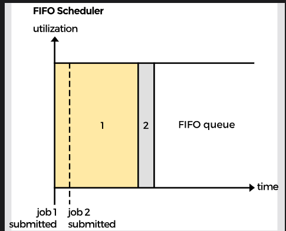

# Tuần 5, 6: Big Data Course

Created: November 6, 2024 10:47 AM
Class: My Reports

# Big Data

3 tính chất

- Volume (Dung lượng lưu trữ)
- Velocity (Tốc độ dữ liệu thu thập được và xử lý)
- Variety (Đa dạng dữ liệu) - dữ liệu có thể có nhiều kiểu

Ngày nay, nhiều thuật ngữ khác dùng để miêu tả Big Data

- Veracity (Độ chính xác): Chất lượng của dữ liệu được thu thập
- Value (Giá trị): giá trị hữu hình có thể khai thác từ dữ liệu
- Visualization (Trực quan hóa): Những người nontech cũng có tehẻ hiểu được, data thành information, insight, knowledge
- Variability (Sự thay đổi)

# Data Warehouse

Kho dữ liệu là hệ thống thu thập dữ liệu từ nhiều nguồn, chuyển đổi và lưu trữ để dùng cho phân tích báo cáo. DW lưu một lượng lớn dữ liệu trong quá khứ và chấp nhận những truy vấn phức tạp và phân tích nhanh lượng dữ liệu vào. Nhưng không phù hợp với những phân tích phức tạp

## Data Warehouse vs Database

DB thường dùng cho Online Transaction Processing (OLTP), đọc ghi dữ liệu, xử lý những giao dịch liên tục, đảm bảo tốc độ thay đổi dữ liệu nhanh

DW dùng cho Online Analytical Processing (OLAP), tổng hợp và tìm kiếm trong bộ dữ liệu lớn, đáp ứng tốt những phân tích phức tạp

## Big Data vs DW

DW chứa những dữ liệu có cấu trúc

Big data chứa những nguồn dữ liệu có cấu trúc không rõ ràng

## DW vs DataLake

DataLake (Hồ dữ liệu) là nơi lưu trữ dữ liệu thô, có và không có cấu trúc từ các nguồn, đây là nơi chứa dữ liệu với tất cả các loại, kích thước và định dạng nguyên bản. DL thường có dung lượng lưu trữ lớn hơn DW

DW chứa dữ liệu đã được xử lý phục vụ cho phân tích

# YARN

YARN được xem như hệ điều hành của các cluster, quản lý tài nguyên tính toán, bộ nhớ, băng thông,… của cluster và lập lịch các công việc

Kiến trúc của YARN

- Resource Manager
- Node Manager

Hai bộ phận hoạt động theo quan hệ Master - Slave

## Resource Manager

RM chịu trách nhiệm cấp phát tài nguyên, RM bao gồm 2 phần

- Application Manager: tiếp nhận các job và khởi tạo ApplicationMaster, đồng thời restart Application Master nếu lỗi
- Scheduler: chỉ phân phối tài nguyên bộ nhớ, không quản lý ứng dụng và khởi tạo tạo ứng dụng nếu lỗi

## Node Manager

NM khởi chạy container, quản lý tài nguyên sử dụng bởi container, thông báo lại cho Scheduler về tài nguyên sử dụng

# Workflow

Client submit job đến RM tạo Application Master, RM tìm một Node Manager tạo container để quản lý AM. AM có thể tự chạy job hoặc yêu cầu RM cấp phát tài nguyên 

Sau đó, RM có Node Manager ở các máy khác khởi chạy containers khác thay cho AM để thực hiện tính toán phân tán

# Horizontal Scaling vs Vertical Scaling

Horizontal Scaling là thêm nhiều máy vào trong tài nguyên

Vertical Scaling là tăng hiệu năng CPU, RAM,… của một máy

# Scheduling

- FIFO first in first out: sắp xếp các job theo thứ tự submit, đơn giản nhưng không phù hợp với các cụm được chia sẻ, job lớn có thể chặn job nhỏ

- Capacity Scheduler: chia tài nguyên thành các queue, App sẽ submit job lên các queue này, các queue được cấu hình một lượng tài nguyên nhất định

- Fair Scheduler: tài nguyên được phân bố đồng đều cho các queue

# MapReduce

Ý tưởng của MapReduce giống thuật toán chia để trị. Một bộ dữ liệu lớn được chia cho các máy, khi tiến trình được hoàn thành, dữ liệu ở từng máy sẽ được tập hợp thành một kết quả cuối cùng

MapReduce là một hệ thống batch processing, không phù hợp với interactive analysis

- Map: người dùng chỉ định hàm để tạo ra các cặp key value
- Reduce: nhận các cặp key value được gom nhóm, xử lý để cho ra kết quả cuối

## Đặc điểm của MapReduce

- Phân tán
- Song song
- Chịu lỗi
- Khả năng mở rộng

Cần implements Writeable cho Map và WritableComparable cho reduce

# MAP

Mỗi Map Task làm việc với 1 phần dữ liệu (input split). Output của mỗi MapTask được ghi ra trên 1 bộ đệm vòng mặc định 100MB

Khi bộ đệm đầy trước khi MapTask hoàn thành, một luồng ngầm sẽ ghi từ bộ đệm ra đĩa (spill file), lưu trong đĩa local của node chạy MapTask, không lưu trong HDFS.

Trước khi dữ liệu của MapTask được ghi vào đĩa, chúng sẽ được chia thành partitions

Dữ liệu sắp xếp chỉ ở bên map, không ở bên reduce

# Reduce

ReduceTask sao chép dữ liệu từ nhiều MapTask bằng giao thức HTTP

RT không đợi toàn bộ  MT hoàn thành mà bắt đầu sao chép song song từ những maptask đã hoàn thành

Mỗi reduceTask nhận một partition của dữ liệu từ maptask

Dữ liệu từ mapper đã được shuffle trước khi move to reducer

Ghi merge thì lại call sort

Ở bước reduce, hàm reduce sẽ được gọi cho mỗi khóa và thực hiện cho danh sách các giá trị tương ứng, một reduce task sẽ xử lý tất cả giá trị của một khóa cùng lúc

# DiskBlock

Là đơn vị nhỏ nhất được đọc ghi trong hệ thống file. Công việc mà filesystem làm là các hành động được thực thi trên diskblock. File system không viết các block riêng lẻ mà viết trên vài block cùng với nhau 

# Distributed file systems

DFS sử dụng mạng để gửi, nhận và tạo cho clients một giả lập về hệ thống file local. File có thể được lưu trữ trong 1 server trung tâm hoặc qua trong nhiều servers.

Một hệ thống file phải biết rõ block đĩa nào chứa file và metadata liên quan đến file đó. HDFS cũng vậy

Node chạy trên MapReduce phải gần data để giảm sự tắc nghẽn mạng

Kiến trúc của HDFS dựa trên mô hình master/slaves

Client gọi Namenode để đọc hoặc ghi file, Namenode sẽ trả về địa chỉ của Datanode tương ứng, Client sau đó tương tác trực tiếp với Datanode (giảm thiểu bottleneck trên Namenode)

Namenode lưu filesystem metadata trong mem, giới hạn số lượng file trong sys bởi dung lượng mem của Namenode, có thể improve bằng horizontal scale

# Disk Blocks vs HDFS Blocks

DiskBlocks thường có dung lượng 512 byte

Filesystem thực chất làm việc với filesystemBlock không phải diskblock

HDFS không phải physical filesystem, cách duyệt file không giống local

# HDFS block

Một file trong HDFS được chia thành các HDFS block, các HDFS sẽ được tạo thành từ physical filesystem blocks

Ưu điểm là file có thể lớn hơn dung dượng của từng disk trong cluster

Hadoop hiện tại mặc định HDFS block là 128MB, nếu lưu 10MB thì chỉ chiếm 10MB chứ không chiếm hết cả 128MB

HDFS block không phải đơn vị lưu trữ mà là một đơn vị trừu tượng để Namenode quản lý và lưu metadata về các block, nói cách khác thì HDFS block là đơn vị nhỏ nhất NameNode tham chiếu

Mỗi block có thể được nhân bản

## Large Block Size

### Giảm tải bộ nhớ namenode

Namenode sẽ phải lưu toàn bộ metadata của block, thường là 150byte cho mỗi block, không quan tâm đến kích thước block.

Giả sử nếu Blocksize là 1kb thì 1file 10kb chiếm 10 block, namenode sẽ phải lưu hết metadata của 10 block này, trong khi nếu tăng block size lên 10kb thì chỉ cần lưu metadata của 1 block

### Giảm thời gian tìm

HDFS không hỗ trợ ghi file đồng thời, dữ liệu được thực hiện liên tục trên đĩa

### Tăng thông lượng mạng

Block to thì đỡ phải truyền đi truyền lại giữa các máy

### Tăng hiệu năng MapReduce

Nếu blocksize lớn thì làm giảm mapper, tăng hiệu năng

## Ideal Block Size

Trong mapreduce, dữ liệu chia thành các split, nếu blocksize quá lớn làm cho split quá ít, không tận dụng được tối đa khả năng của cluster

nếu kết nối TCP fail thì việc truyền lại block lớn sẽ tốn nhiều chi phí hơn

# Block Replication

Block có thể đc nhân bản để tránh mất mát dữ liệu. Nếu block fail thì các block replica có thể dùng để đáp ứng yêu cầu đọc 

# NameNode

## Namespace Image File (FS Image)

FS img là một snapshot về HDFS metadata tại một thời điểm nhất định.

**EditLog** là nhật ký lưu thay đổi gần nhất về metadata mà chưa có trong FSI

## Working of the Namenode

Khi Namenode chạy, nó lấy FS image và Editlog, apply để lấy được trạng thái mới nhất của metadata, NameNode ghi trạng thái mới nhất cho FS image bắt đầu hành động với 1 editlog rỗng

## Secondary NameNode

Edit log lớn có thể làm thời gian chạy lâu, SecondaryNode sinh ra làm giảm thời gian chạy NameNode.

SN định kì gộp edit log với FSI để dung lượng của editlog không bị vượt giới hạn. 

SN chỉ trợ giúp primaryNameNode, không thể thay thế khi fail. Thường SN chạy ở máy khác vì nó yêu cầu tài nguyên giống hệt name node

## Single point of failure

Namenode fail dẫn đến toàn hệ thống fail, không thể đọc ghi,..

Solution

- Backup FS file and editlog
- Secondary NameNode
- Standby NameNode

## Limitation

Namenode lưu metadata trên memmory, nếu có quá nhiều file, mem quá tải. Mặc dù có thể lưu 1 file lớn nhưng không thể lưu nhiều file nhỏ

Namenode is reachable on HTTP port 9870

# DataNode

Datanode lưu các data block trong local filesystem và gửi report cho namenode

Namenode is reachable on HTTP port 9864

# Reading and Writing in HDFS

## Writing

Client sẽ đệm file trên đĩa local, đợi tích lũy thành một HDFS block trước khi kết nối vs namenode

Namenode khi kết nối vs client sẽ kiểm tre file tồn tại và Client có quyền tạo file hay không, nếu pass thì namenode sẽ thay đổi namespace tương ứng, sau đó trả về cho client list datanode để ghi.

Client bắt đầu ghi vào datanode đầu tiên, datanode đó nhận được phần dữ liệu đầu tiên, viết vào local repo và sau đó truyền phần đó sang second datanode

Secondatanode cũng làm tương tự

## Reading

Client gọi namenode tìm địa chỉ của những block đầu tiên của file

Namenode trả về list địa chỉ datanode chứa bản sao của mỗi block, được sắp xếp gần nhất với client.

Nếu client chạy trên datanode host bản sao của block, nó sẽ đọc từ bản sao cục bộ, nếu không có thì client kết nối vs datanode gần nhất để tìm kiếm block đầu tiên của file

Data sẽ được stream từ datanode tới client cho đến hết block, sau đó quá trình được tiếp tục, client chọn datanode tiếp theo gần nhất để tìm kiếm block tiếp theo

Nếu datanode bị lỗi, hệ thống sẽ tìm datanode gần nhất tiếp theo chứa bản sao của block để tiếp tục thực hiện

# High Availability

Do Namenode là single point of failure, Hadoop 2x đã giới thiệu kiến trúc Namenode High Availability, có 2 namenode, trong 1 thời điểm chỉ có 1 cái active, còn lại là **Standby Namenode**

## Journal Nodes

Standby Node sẽ thay thế Namenode nếu fail, để làm được điều này cần phải triển khai cụm Journal Nodes. 

Cụm JN sẽ ghi lại các thay đổi mà NameNode thực hiện (Cần nhiều JN vì JN dễ fail)

Khi khôi phục thì Standby Namenode sẽ đọc từ cụm JN 

FailOver Controller là một thành phần liên quan đến Zookeeper định kì ping Namenode, báo cáo healthcheck và report bất kỳ failure nào của NN cho ZK

Standby NN có thể delay để apply được các thay đổi được ghi trong JN

HDFS chạy trong HA mode thì standby NN sẽ thay thế Secondary NN, chịu trách nhiệm định kỳ backup metadata, Datanode trong HA sẽ gửi report và heartbeat cho cả active và standby

Chỉ có 1 active NN được ghi vào JN, do phân vùng mạng, mỗi NN có thể tưởng rằng chỉ có mình nó sống và sẽ cùng ghi vào JN, gây mất đồng bộ

## Fencing

Là cơ chế ngăn node active cũ tiếp tục cung cấp data cho clients

STONITH (shoot the other node in the head), ngắt nguồn cung cấp điện dừng tiến trình namenode

## Shared NFS (Network File System) directory

Cách thứ 2 để cấu hình HA HDFS

edit log được chia sẻ giữa các NN bằng NFS

Active NN ghi lại các thay đổi vào file này, standby NN sẽ liên tục kiểm tra file này để apply các thay đổi

# Spark

Spark có kiến trúc Master Slave giống Mapreduce, với 2 thành phần

- Driver: quản lý việc thực thi Sparkjob, duy trì trạng thái của Spark Application, phản hồi user
- Executor: thực thi code được driver giao cho nó, report trạng thái tính toán của ex lên driver

Spark và MR không óc khả năng cấp phát tài nguyên của cụm để thực thi job, do đó phải chạy với clustermanager

Spark có thể chạy hai chế độ

- Cluster: client submit SparkApplication (Script) tới cluster manager, CM gọi driver và các workernode để thực thi, driver và ex nằm trong cluster
- Client: Giống Cluster, khác ở chỗ driver được hosting bởi client, client chịu trách nhiệm maintain driver, cluster maintain các executor

## SparkApp Life Cycle

1. User submit Spark Job tới cluster. Nếu sử dụng YARN, sau đó client connect với Resource Manager, nếu job accepted thì RM tạo Spark Driver trên 1 trong các máy trong cluster
2. Driver chạy để thực thi code, code phải cài đặt SparkSession
3. RM chạy Spark Executor trong các node, trả về location của các executor cho driver
4. Driver giao task cho executor, bắt đầu thực thi, data có thể di chuyển trên executors
5. Driver exit khi Sparkjob hoàn thành và Cluster Manager shutdown ex process

## SparkAPI

## Resilient Distributed Dataset (RDDs)

Read only, được phân mảnh trên cluster để xử lý song song, có thể khôi phục nếu node hosting nó bị lỗi

RDD là low-level API, DF và DS complie thành RDD

Không được khuyến khích dùng

**Resilient**: RDD có khả năng chịu lỗi, khôi phục. RDD lưu giữ các trạng thái chuyển đổi với linage graph

**Distributed:** Data được tạo bởi RDD phân tán giữa các node

**Dataset:** tập các bản ghi dữ liệu, json, csv,…

Transformation: input là RDD và output là RDD khác

Action: input là RDD, output là kết quả

Lazy-transformation: các transformation chưa được thực thi cho đến khi gặp action

## DataFrames

Biểu diễn dưới dạng bảng, có schema, có partition, bất biến, chỉ có thể tạo DF mới từ DF ban đầu

Partition là collection of rows từ DF

rows là đối tượng đại diện cho 1 bản ghi

Spark có thể tự tìm ra schema của DF bằng inferSchema, không nên sử dụng vì nếu dùng, Spark sẽ quét toàn bộ DF, nếu DF có rất nhiều bản ghi sẽ gây giảm hiệu năng

## DataSet

Strongly type, type-safe structured

Datasets aren’t supported in R and Python because those languages are dynamically-typed. After Spark 2.0, RDD was replaced by Dataset, which is strongly-typed like an RDD, but with richer optimizations under the hood.

encoder :maps domain-specific type to Spark’s internal representation for that type

Domain-specific types are expressed as beans for Java and case classes for Scala

check type lúc compile còn dataframe quan âm type lúc runtime. data frame dc coi như dataset với type row

use-case : thực hiện toán tử mà bắt buộc phải dạng dataset, type-safety check lúc compile, case class(trong apply transformation 

# Zookeeper

Zookeeper là dịch vụ tập trung để duy trì các thông tin cấu hình, cung cấp các dịch vụ đồng bộ hóa 

Thành phần cơ bản của Zk là znode, znode có thể lưu trữ dữ liệu hoặc có node con.

Có thể chạy 2 mode là standalone và replicated mode

Replicate mode gọi là ensemble, sử dụng zab protocol

B1: chọn leader, các node khác thành follower đồng bộ trạng thái của leader

B2: write request được chuyển cho lead, sau đó lead sẽ thông báo update cho các follower, sau đó client sẽ được thông báo commit thành công. Các máy ghi cập nhật vào đĩa trước khi cập nhật trọng RAM.

Client có thể trực tiếp yêu cầu đọc với bất kì máy nào. Đọc từ RAM nên rất nhanh

Nếu lead chết thì bầu lại, nếu sống lại thì thành followers

## DataModel

Znode có Access Control List để quản lý xem ai có thể đọc ghi trên znode

Thao tác đọc ghi là atomic

Các znode được tham chiếu bằng path như hệ thống tệp

**Ephemeral znodes**: Các znode tồn tại tạm thời và tự động bị xóa khi phiên của client tạo chúng kết thúc.

**Sequential znodes**: Có thêm số thứ tự tự tăng dần ở cuối tên. Điều này giúp thiết lập thứ tự toàn cục trong một hệ thống phân tán và có thể dùng để xây dựng cơ chế khóa phân tán.

Zookeeper có thể thiết lập theo dõi (*watch*) trên các znode, giúp nhận thông báo khi một znode thay đổi. Một ứng dụng có thể thiết lập watch để giám sát cấu hình của mình và nhận thông báo khi cấu hình bị thay đổi bởi ứng dụng khác.