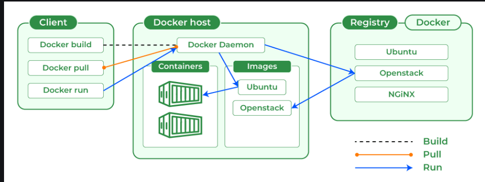

# Tuần 8: Linux shell and Docker

Created: November 20, 2024 10:11 AM
Class: My Reports

# Linux Shell

List directory content ls

Một số tag đi kèm:

-a: list toàn bộ

-A (almost all) giống -a nhưng không list .(thư mục hiện tại) và ..(thư mục cha)

-d (directory) in kèm chi tiết về thư muc

-F (classify) thêm 1 ký tự / khi đó là tên thư mục

-h (human readable)

-l :long format

-r reverse alphabetical order

-S:  sort by file size

-t sort by modification time

Make directory mkdir

Move and Rename File mv

-i interactive: xác nhận trước khi xóa file

-r recursive: cần phải có tag  này khi xóa directory

-f force bỏ qua lỗi mà không cần thông báo

-v verbose: thông báo khi xóa thành công

Change directory cd: thay đổi thư mục làm việc

Cp src des: copy file nguồn đến file đích

Mv src des: di chuyển file vào thư mục hoặc đổi tên file

head: hiển thị phần đầu của file

cat: hiển thị nội dung file

copy nội dung file vào standard output

hoặc dùng để nối các file vd cat movie.mpeg.0* > movie.mpeg

chmod thay đổi quyền

chown thay đổi người sở hữu, nhóm sở hữu

`cat test.txt`: Hiển thị nội dung của file `test.txt`.

- `|`: Chuyển kết quả đầu ra của `cat` làm đầu vào cho `wc -l`.
- `wc -l`: Đếm số dòng trong file.
- **Kết quả:** Hiển thị số dòng trong file `test.txt`.

cat test.txt | grep "a" : đưa ra các dòng trong file có ký tự a

cat test.txt | head đưa ra phần đầu của file

echo "aabb"  > test.txt: ghi đè nội dung file test bằng aabb, nội dung cũ bị xóa
echo "cc" >> test.txt: chèn thêm vào cuối file test nội dung là cc

vim là một trình chỉnh sửa file trên linux

vim <filename> tạo file mới hoặc chỉnh sửa file

các chế độ normal, insert, command line

ấn esc để về normal, sau đó ấn i để sang insert hoặc ấn : để sang commandline

wq trong command line để lưu file

# Docker

Docker dùng để đóng gói ứng dụng, chạy trên các môi trường khác nhau

## Container vs VM

Container và VM đều hỗ trợ để ảo hóa

VM yêu cầu cả hệ điều hành, tốn tài nguyên và khời chạy lâu hơn. 

Container dùng chung OS kernel và tách riêng ứng dụng và các dependencies

> docker chỉ trừu tượng hóa ở application layer nhưng VM trừu tượng hóa cả OS kernel layer
> 

## Docker Architecture

Docker sử dụng kiến trúc Client Server, 

Docker CLient → (RESTAPI) Docker Daemon → (pull Image) Registry → run Container

***Docker Daemon*** quản lý các đối tượng khác như Image, Container, Volumes, Network

***Docker Client*** có thể tương tác với nhiều Docker daemon, DC chạy command, terminal gửi đến Docker Daemon dưới dạng RestAPI

***Docker Registry*** là nơi lưu các Image, DockerHub là một Registry

***Docker Image*** là các bản thiết kế của Container, định nghĩa tất cả những gì mà ứng dụng cần để chạy, read-only, immutable

***Docker Container*** là instance runtime của Image, đóng gói ứng dụng và các thành phần của nó

Docker Volumes là hệ thống file được lưu trên máy chủ, được gắn vào container để lưu các dữ liệu được ghi từ container, được quản lý bởi Docker và không thể bị thay đổi ở các tiến trình khác

Bind Mounts là hệ thống file được lưu trên máy chủ, được gắn vào container giống Volumes nhưng có thể được truy cập từ các tiến trình ngoài Docker, cho phép Docker có thể thay đổi hệ thống file trên máy chủ, không thể quản lý qua CLI